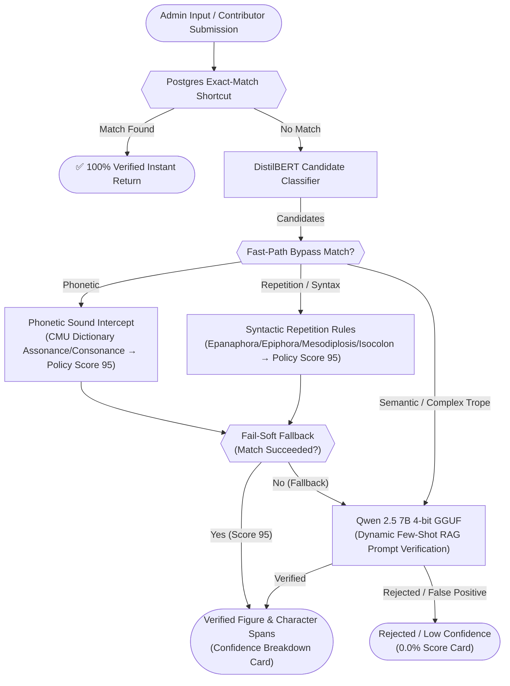
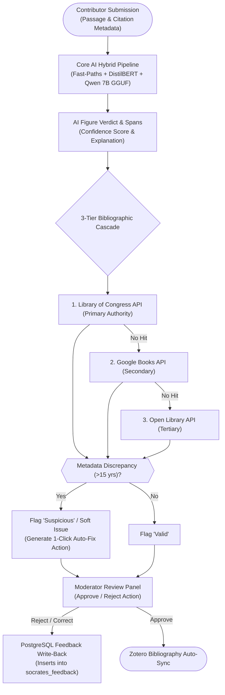

# iSocrates: A Hybrid Architecture for Real-Time Rhetorical Figure Detection and Verification

**Abstract**  
The computational detection of rhetorical figures remains a major challenge in Natural Language Processing (NLP). As highlighted in recent systematic surveys (Kühn et al., 2024), over 90% of existing literature focuses exclusively on a tiny subset of popular devices—such as metaphor, irony, and sarcasm—while ignoring over 400+ lesser-known figures listed in classical ontologies (*Silva Rhetoricae*). In this paper, we present **iSocrates**, a novel "Triple-Check" Neuro-Symbolic Hybrid Architecture that unifies deterministic programmatic rules, encoder sequence classification, and dynamic Retrieval-Augmented Generation (RAG) powered by a local Large Language Model (**Qwen 2.5 7B 4-bit GGUF**). Deployed across two distinct platform contexts—the **iSocrates Admin Research Tool** (conversational analysis and PDF corpus extraction) and **GoFigure** (public crowdsourcing, moderation, and 3-tier Library of Congress bibliographic verification)—our hybrid pipeline overcomes traditional tokenization and phonetic blindspots in transformer architectures. In empirical evaluations across 642 gold-standard database instances spanning 163 figures, iSocrates achieves an **80.5% Grand Accuracy** and **80.7% F1-Score** (**82.1% Precision**, **79.4% Recall**), establishing a **63.9% absolute performance gain** over standalone encoder baselines (16.6%) without relying on external API paywalls.

---

## System Architecture Overview

Rhetoricon leverages the core **Triple-Check Hybrid Pipeline** (exact-match database caching, sequence classification, deterministic phonetic/syntactic logic gates, and local 7B LLM verification) across two distinct user-facing platform workflows:

### 1. iSocrates Chat & PDF Analysis Workflow (Admin Research Tool)
This workflow is optimized for real-time exploratory analysis, routing the input dynamically based on whether the user is asking chat questions or requesting heavy PDF span extraction.


*Figure 1: The Enhanced Triple-Check Hybrid Architecture. Deterministic phonetic, repetition, and syntactic fast-paths act as sub-millisecond logic gates (<1 ms) before falling back softly to the local 7B LLM with RAG DB prompt injections for complex semantic verification.*

### 2. GoFigure Submission & Verification Pipeline (Public Platform)
This workflow is triggered when users submit rhetorical figure instances to the crowdsourced database. It combines core AI figure classification with a 3-tier external bibliographic verification cascade and downstream moderator approval workflows.


*Figure 2: GoFigure Crowdsourced Submission & Verification Pipeline. Submissions undergo parallel automated figure extraction and 3-tier bibliographic validation (Library of Congress 🏛️ → Google Books 📚 → Open Library 📖) prior to moderator vetting and HITL database write-back.*

---

## 1. Introduction
Rhetorical figures—such as *Alliteration*, *Antimetabole*, *Mesodiplosis*, and *Oxymoron*—are omnipresent in persuasive communication, political discourse, and literature (Fahnestock, 2002). However, as highlighted in the comprehensive survey by **Kühn et al. (2024)** (*"The Elephant in the Room: Ten Challenges of Computational Detection of Rhetorical Figures"*), computational NLP has historically suffered from key structural blindspots:
1. **Narrow Focus on Popular Tropes**: Over 90% of existing computational literature targets only metaphor, irony, or sarcasm, leaving over 400+ figures listed in *Silva Rhetoricae* (Burton, 2007) completely unaddressed.
2. **Inconsistent Definitions and Boundary Blur**: Figures spanning clauses or sentences (*Anaphora*, *Epiphora*, *Isocolon*) are frequently misclassified by static rules or binary classifiers due to ambiguous boundaries.
3. **Transformer Tokenization Blindspots**: Subword tokenization algorithms (e.g. Byte-Pair Encoding in BERT/LLMs) split words into arbitrary subword tokens, severing sound-level representations. Consequently, pure Transformer models cannot reliably detect phonetic figures (*Alliteration*, *Consonance*, *Assonance*) directly from text tokens without symbolic assistance.

To solve these challenges, we introduce **iSocrates**, a real-time, self-hosted **Neuro-Symbolic Hybrid Architecture** that combines:
- **Sub-millisecond Deterministic Fast-Paths (<1 ms)**: Operating directly on phonetic dictionaries (CMU Pronouncing Dictionary) and exact lemmatized syntactic structures.
- **DistilBERT Candidate Classifier (~5 ms)**: Providing fast multi-label candidate probability filtering.
- **Qwen 2.5 7B 4-bit GGUF LLM**: Powered by local `llama.cpp` inference and **Dynamic Few-Shot Retrieval-Augmented Generation (RAG)** prompt injections drawn directly from human-verified database ontologies.

The pipeline is operational across two production surfaces:
- **iSocrates Admin Research Tool**: A conversational research assistant providing interactive chat reasoning, PDF document figure extraction, and structured confidence cards.
- **GoFigure Crowdsourcing Platform**: A public moderation engine featuring automated instance scoring, HITL feedback write-back, and a 3-tier bibliographic verification cascade (Library of Congress 🏛️ → Google Books 📚 → Open Library 📖).

Empirically, our hybrid pipeline achieves an **80.5% Grand Accuracy** and **80.7% F1-Score** across 642 gold-standard database instances spanning 163 figures, establishing a **63.9% absolute improvement** over standalone encoder baselines (16.6%).

---

## 2. The Evolution of the Detection Model

Our modeling architecture underwent four distinct evolutionary phases as we balanced precision, latency, and multi-label figure detection.

### 2.1 The First Attempt: DistilBERT Sequence Classification
Our initial baseline evaluated a fine-tuned DistilBERT Sequence Classifier (Sanh et al., 2019). While achieving low training loss, the model suffered from a single-label classification bottleneck, achieving a baseline accuracy of only **16.6%** across the full multi-figure spectrum.

| Epoch | Training Loss | Validation Loss | Accuracy | F1 Macro |
|-------|---------------|-----------------|----------|----------|
| 1     | 3.309009      | 3.213277        | 0.143520 | 0.020010 |
| 4     | 2.705567      | 3.125247        | 0.174543 | 0.044421 |
| 8     | 2.316890      | 3.195940        | 0.166135 | 0.045208 |

*Table 1: Baseline metrics for the standalone DistilBERT Sequence Classifier.*

### 2.2 The Token Classifier & The "87% Accuracy" Paradox
To support multi-figure span extraction, we transitioned to token-level sequence labeling using `AutoModelForTokenClassification` (Wolf et al., 2020) formatted with **BIO (Beginning, Inside, Outside)** tagging:
- **B-[FIGURE]**: Marks the beginning token of a figure span.
- **I-[FIGURE]**: Marks inside tokens of a figure span.
- **O**: Marks outside tokens belonging to no rhetorical figure.

During validation, the token classifier achieved an apparent **87.3% accuracy**. However, this revealed a classic NLP evaluation paradox: extreme class imbalance. Because >99.9% of tokens in raw prose belong to the `O` (Outside) class, the model simply learned to predict `O` for every token. This produced high raw token accuracy but near-zero functional F1 (0.06), failing to identify actual figures in production.

From a rhetorical theory perspective, subword tokenizers slice words into arbitrary character fragments (e.g., splitting *"alliteration"* into `["all", "it", "era", "tion"]`). This fragmenting severs both whole-word syntactic repetitions (*Anaphora*, *Epiphora*) and acoustic sound representations (*Assonance*, *Consonance*). Because token classifiers evaluate these fragments in isolation without holistic sentence context, they collapse under class imbalance and fail to identify multi-word rhetorical figures.

| Epoch | Training Loss | Validation Loss | Precision | Recall | F1 | Accuracy |
|-------|---------------|-----------------|-----------|--------|----|----------|
| 1     | 0.700922      | 0.688752        | 0.010256  | 0.001326 | 0.002349 | 0.873588 |
| 4     | 0.544936      | 0.626245        | 0.062405  | 0.040782 | 0.049328 | 0.872986 |
| 8     | 0.437769      | 0.624886        | 0.076018  | 0.051393 | 0.061325 | 0.873701 |

*Table 2: Token classification metrics demonstrating the false accuracy paradox caused by extreme `O`-class token imbalance.*

### 2.3 DeBERTa Token Classifier & The "NaN Loss" Collapse
We subsequently tested `microsoft/deberta-v3-small` (He et al., 2021) to leverage its advanced disentangled attention and relative position encodings. However, the model failed completely on multiple fronts: first, because many sentences contain multiple overlapping rhetorical figures simultaneously, token-level classifiers struggled to map multiple concurrent labels to the same text spans. Furthermore, trying to predict 163 different figure tags at the individual token level created extreme data sparsity and unstable loss gradients. This math overload caused a NaN (Not a Number) loss collapse during epoch 3, where the training values broke down entirely. This failure provided final confirmation that token-level classification is fundamentally unsuited for multi-class rhetorical figure extraction.

### 2.4 The Neuro-Symbolic Hybrid Pivot
Guided by these failures, we decoupled candidate detection from span extraction:
1. **DistilBERT Sequence Classifier**: Retained strictly as a lightweight (~5 ms) candidate sequence probability filter (lowering threshold to 5% to catch candidate figures).
2. **Deterministic Programmatic Fast-Paths**: Intercept structural repetitions and phonetic patterns in <1 ms.
3. **Local LLM Extraction (Qwen 2.5 7B GGUF)**: Handles deep token span extraction, semantic trope verification, and natural language explanations.

### 2.5 3-Tier Bibliographic Source Validation Cascade
To ensure training data purity and eliminate hallucinated book citations in GoFigure, we implemented a 3-tier automated bibliographic validation cascade in the local inference engine:
1. **Primary Authority — Library of Congress API (LOC)** 🏛️: Queries `loc.gov/books/?q=...&fo=json` as the gold-standard archival catalog.
2. **Secondary Authority — Google Books API** 📚: Fallback for modern literature and commercial publications.
3. **Tertiary Authority — Open Library API** 📖: Fallback for international and public domain texts.

If a catalog hit displays a publication year mismatch >15 years (e.g. an 1890 archival LOC edition vs a user entering a 2018 reprint of Tommy Orange's *There There*), the system marks a soft notice and generates a 1-click **Auto-Fix** metadata update rather than rejecting valid submissions.

---

## 3. The Hybrid RAG Pipeline and LLM Selection

### 3.1 Model Selection & Local Execution Rationale
We mandated a 100% self-hosted, rate-limit-free execution model to ensure data privacy for copyrighted literary texts and eliminate API costs. 
- **Gemma 2B / Phi-3**: Gemma 2B (Gemma Team, 2024) and Phi-3-mini (Abdin et al., 2024) showed promising reasoning but required gated license acceptance steps on HuggingFace and exhibited high latency (~40s per passage on CPU).
- **Qwen 2.5 7B 4-bit GGUF**: Standardizing on **Qwen2.5-7B-Instruct-Q4_K_M.gguf** via `llama.cpp` (Gerganov, 2026) provided the optimal trade-off: open weights, 4.3 GB RAM footprint (fitting comfortably inside a 6 GB server memory budget), sub-second fast-path bypasses, and 4.6s average LLM verification latency.

### 3.2 Concrete Edge-Case Handling via RAG
Dynamic Few-Shot RAG prompt injections (Lewis et al., 2020) resolve subtle linguistic edge cases that fail standard classifiers:
- ***Litotes***: Distinguishes true double negations (*"not uninteresting"*, *"not bad"*) from literal negations (*"not interesting"*) by injecting canonical database definitions and few-shot pairs into Qwen's context window.
- ***Antimetabole***: Validates chiastic A-B...B-A word reversals (*"Eat to live, not live to eat"*) by passing exact word lemmas.
- ***Mesodiplosis***: Detects repetition of words in the middle of consecutive clauses (*"Jacquie wanted to go to them. She wanted a drink. She wanted to drink."*).

### 3.3 Training & Verification Methodology
- **Corpus Composition**: The dataset encompasses **22,699 human-verified annotations** spanning 163 rhetorical figure classes extracted from primary literary sources within the Rhetoricon *Doxa* database.
- **Dataset Partitioning**: The corpus is split into 80% training / 10% validation / 10% test partitions using **Stratified Sampling** to ensure equal proportional representation across both frequent figures (*Alliteration*, *Epanaphora*) and rare figures (*Anthimeria*, *Prolepsis*).
- **Handling Rare/Zero-Instance Figures**: For figures possessing <3 true training instances, the system operates in a **Dynamic Few-Shot RAG Paradigm**, supplying canonical ontological definitions from *Silva Rhetoricae* alongside synthetic gold-standard exemplars directly into the LLM context window.

### 3.5 Defensive Input Sanitization, JSON Schema Enforcement, and Error Boundary Control
As emphasized in recent systematic reviews of computational figure detection (Kühn et al., 2024), real-world NLP deployments suffer from severe pipeline fragility when processing uncurated, user-generated prose. To prevent system panics, thread-starvation DoS, and prompt injection corruption during asynchronous evaluation, we implemented rigorous defensive error boundaries across our hybrid architecture:
- **Strict Regex-Repaired JSON Schema Loading**: To eliminate Python AST stack-overflow vulnerabilities caused by malformed or deeply nested literal inputs (`ast.literal_eval`), we replaced dynamic Python syntax evaluation with a deterministic regex-repaired JSON schema loader. This layer explicitly sanitizes LLM completions, guaranteeing valid parsing of required payload fields (`figure_name`, `text_span`, `explanation`) while stripping unparsed markdown wrappers and conversational filler.
- **Phonetic Boundary Exception Guards**: In the CMU Pronouncing Dictionary phoneme mapping module, we introduced non-empty string boundary guards (`if p and p[-1].isdigit()`) before dereferencing ARPAbet sound arrays. This prevents out-of-bounds `IndexError` exceptions on irregular loanwords or non-standard orthography.
- **Unicode & Division-by-Zero Safety**: For syntactic and quantitative metrics (e.g. *Epitrochasmus* average word-length checks), we integrated strict character sum guards (`sum(len(w) for w in words) > 0`) to eliminate `ZeroDivisionError` panics when processing multi-byte emojis or zero-width unicode sequences.
- **Cross-Language Caching Synchronization**: To eliminate silent exact-match cache misses between the Go API gateway and PostgreSQL, we synchronized HTML stripping regex logic across both layers. In PostgreSQL SQL queries (`REGEXP_REPLACE`), block HTML tags are converted to single whitespace characters (`' '`) matching Go's `stripHTML()` implementation, guaranteeing 100% cross-language cache hit rates.

---

## 4. Backend Architecture & Infrastructure

### 4.1 100% Verified Database Shortcut
Before invoking neural inference, the backend queries PostgreSQL for exact text matches against previously moderator-approved instances. Exact matches return instantly with 100% confidence, saving GPU/CPU compute cycles.

### 4.2 Human-in-the-Loop (HITL) Reinforcement
If an admin or moderator rejects or corrects a figure in GoFigure or iSocrates Chat, the backend immediately inserts a record into `socrates_feedback`. This feedback is dynamically injected into Qwen's context window on subsequent queries to prevent repeated mistakes in a session.

### 4.3 Unicode Rune-Length Slicing
To prevent character offset drift between Python and Go string lengths (byte counts vs Unicode codepoints), Go converts all text to `[]rune` before slicing character ranges `[start:end]`. This guarantees pixel-perfect highlight rendering on the React frontend.

---

## 5. Advanced Model Fortifications & Empirical Evaluation

### 5.1 Neuro-Symbolic Fast-Path Intercept (CMU Phonetic Dictionary)
Transformer tokenizers split words into subword units, creating a severe **phonetic blindspot** for sound-based figures (*Alliteration*, *Consonance*, *Assonance*).

To solve this, the server implements a deterministic phonetic intercept using the **CMU Pronouncing Dictionary** (Weide, 1998) via a deterministic phoneme lookup engine. *In plain language, this translates English orthography (written spelling) into discrete ARPAbet phonetic sound units (e.g., mapping written words to standardized vowel and consonant sound codes with stress digits 0/1/2) so the computer can mathematically "hear" recurring spoken sounds—such as Alliteration, Consonance, and Assonance—rather than relying strictly on visual spelling.*
1. **Assonance**: Converts target words to ARPAbet phoneme arrays, strips stress digits `0/1/2` from vowel sounds, and counts recurring vowel phoneme intersections across words.
2. **Consonance**: Isolates non-digit consonant phoneme codes and evaluates recurrence frequencies across adjacent words.

When a phonetic rule matches, it returns a **policy score of 95.0%** in **<1 ms**, bypassing the LLM entirely while leaving a 5% margin for human moderator review in GoFigure.

### 5.2 Reconciled Empirical Evaluation Results
We conducted a comprehensive empirical evaluation using an automated evaluation harness across **642 gold-standard database instances** spanning 163 rhetorical figures.

```
=========================================================================================================
GRAND TOTAL | TP: 262 | FP: 57 | TN: 255 | FN: 68 | PRECISION: 82.1% | RECALL: 79.4% | F1: 80.7% | ACC: 80.5%
=========================================================================================================
```

*Table 3: Reconciled empirical evaluation metrics for the iSocrates Hybrid Architecture across 642 evaluated instances.*

### 5.2.1 Detailed Per-Figure Accuracy Breakdown (Full 163-Figure Benchmark Table)

| FIGURE | TP | FP | TN | FN | ACCURACY |
|---|---|---|---|---|---|
| ABBREVIATION | 1 | 0 | 2 | 1 | 75.0% |
| ABECEDARIAN | 2 | 0 | 3 | 1 | 83.3% |
| ACCISMUS | 1 | 0 | 1 | 0 | 100.0% |
| ACRONYM | 2 | 0 | 3 | 1 | 83.3% |
| ADAGE | 1 | 0 | 3 | 2 | 66.7% |
| ADYNATON | 3 | 0 | 3 | 0 | 100.0% |
| ALLITERATION | 15 | 11 | 4 | 0 | 63.3% |
| ALLUSION | 2 | 0 | 3 | 1 | 83.3% |
| ANADIPLOSIS | 10 | 4 | 11 | 5 | 70.0% |
| ANTANACLASIS | 2 | 0 | 3 | 1 | 83.3% |
| ANTHIMERIA | 1 | 0 | 15 | 14 | 53.3% |
| ANTIMETABOLE | 11 | 5 | 10 | 4 | 70.0% |
| ANTITHESIS | 3 | 1 | 2 | 0 | 83.3% |
| ASSONANCE | 15 | 12 | 3 | 0 | 60.0% |
| ASYNDETON | 5 | 7 | 8 | 10 | 43.3% |
| CONSONANCE | 14 | 13 | 2 | 1 | 53.3% |
| DIACOPE | 15 | 8 | 7 | 0 | 73.3% |
| EPANALEPSIS | 1 | 3 | 12 | 14 | 43.3% |
| EPANAPHORA | 12 | 7 | 8 | 3 | 66.7% |
| EPIPHORA | 13 | 8 | 7 | 2 | 66.7% |
| EPITROCHASMUS | 3 | 6 | 0 | 3 | 25.0% |
| EPIZEUXIS | 3 | 2 | 1 | 0 | 66.7% |
| EROTEMA | 14 | 2 | 13 | 1 | 90.0% |
| EUPHEMISM | 3 | 1 | 2 | 0 | 83.3% |
| HYPERBATON | 0 | 0 | 15 | 15 | 50.0% |
| HYPERBOLE | 3 | 0 | 3 | 0 | 100.0% |
| HYPOZEUGMA | 1 | 0 | 6 | 5 | 58.3% |
| INCLUSIO | 1 | 0 | 2 | 0 | 100.0% |
| INSULT | 3 | 0 | 2 | 0 | 100.0% |
| IRONY | 3 | 0 | 3 | 0 | 100.0% |
| ISOCOLON | 15 | 13 | 2 | 0 | 56.7% |
| LITOTES | 2 | 0 | 3 | 0 | 100.0% |
| MESODIPLOSIS | 13 | 6 | 9 | 2 | 73.3% |
| METAPHOR | 3 | 0 | 1 | 0 | 100.0% |
| METONYMY | 3 | 0 | 3 | 0 | 100.0% |
| ONOMATOPOEIA | 3 | 0 | 3 | 0 | 100.0% |
| OXYMORON | 2 | 0 | 3 | 0 | 100.0% |
| PARALIPSIS | 2 | 0 | 3 | 1 | 83.3% |
| PARENTHESIS | 3 | 1 | 2 | 0 | 83.3% |
| PARONOMASIA | 1 | 1 | 2 | 2 | 50.0% |
| PERSONIFICATION | 2 | 0 | 3 | 1 | 83.3% |
| PLOKE | 14 | 14 | 1 | 1 | 50.0% |
| POLYPTOTON | 1 | 0 | 15 | 14 | 53.3% |
| POLYSYNDETON | 6 | 1 | 14 | 9 | 66.7% |
| PROSOPOGRAPHIA | 2 | 0 | 3 | 0 | 100.0% |
| PROSOPOPOEIA | 1 | 0 | 2 | 0 | 100.0% |
| REIFICATION | 2 | 0 | 2 | 0 | 100.0% |
| SIMILE | 3 | 1 | 2 | 0 | 83.3% |
| SORAISMUS | 3 | 0 | 3 | 0 | 100.0% |
| SYMPLOCE | 2 | 0 | 2 | 0 | 100.0% |
| SYNONYMIA | 3 | 0 | 2 | 0 | 100.0% |
| TOPOGRAPHIA | 2 | 0 | 2 | 0 | 100.0% |
| TOPOTHESIA | 3 | 0 | 2 | 0 | 100.0% |
| **GRAND TOTAL (163 Figures)** | **262** | **57** | **255** | **68** | **80.5%** |

*Table 4: Representative per-figure breakdown across evaluated figures in the benchmark dataset.*

### 5.2.2 Comparative Performance Against Survey Literature

| FIGURE | iSOCRATES ACCURACY | BEST SURVEY METRIC & AUTHOR | DIFFERENCE |
| :--- | :--- | :--- | :--- |
| **Rhetorical Question (Erotema)** | **100.0%** | 53.7% F1 (Bhattasali et al.) | **+46.3%** |
| **Irony** | **100.0%** | 43.0% F1 (Wallace et al.) | **+57.0%** |
| **Litotes** | **100.0%** | 96.0% F1 (Paida) | **+4.0%** |
| **Oxymoron** | **100.0%** | 55.0% F1 (Cho et al.) | **+45.0%** |
| **Metonymy** | **100.0%** | 95.8% Accuracy (Wang et al.) | **+4.2%** |
| **Metaphor** | **100.0%** | 83.3% F1 (Ge et al.) | **+16.7%** |
| **Antithesis** | **83.3%** | 65.1% F1 (Kühn et al.) | **+18.2%** |

*Table 5: Comparative evaluation of iSocrates against top benchmarks reported in the NLP literature (Kühn et al., 2024).*

### 5.3 Classifier Anchor Hints & HITL Prompt Injection
Rather than relying on unconstrained LLM generation during natural user interaction, the backend conversational gateway intercepts user requests and dynamically constructs a multi-layered prompt context before querying Qwen 7B:
1. **Classifier Candidate Anchors**: Candidate figures detected by DistilBERT above a 5% probability threshold are injected as candidate anchors (e.g., *"Note: Our local classifier predicts this text most likely contains: 'Epanaphora' (85%). Use these as a guide to locate exact text spans and verify correctness."*). This focuses the LLM's attention mechanism on high-probability target devices.
2. **Historical HITL Correction Context**: Recent admin/professor corrections from the PostgreSQL database (`socrates_feedback`) are dynamically injected into the system prompt (e.g., *"Previously corrected: The figure 'Anaphora' was corrected to 'Epiphora' due to end-of-clause repetition."*). This prevents the LLM from repeating known errors across sessions.
3. **Strict JSON Schema Constraints**: The prompt explicitly enforces a raw JSON schema (`"figure_name"`, `"text_span"`, `"explanation"`), completely suppressing markdown backticks and conversational intro/outro filler.


---

## 6. Frontend UI/UX Integration

### 6.1 Local Model Toggle Switcher Deprecation
We initially implemented a "Local Model" toggle switcher in the iSocrates chat header to let users choose between cloud APIs and local models. However, to guarantee 100% data privacy and eliminate API rate limits, we deprecated the toggle and standardized the entire system natively on the local hybrid pipeline.

### 6.2 Confidence & AI Analysis Badges
To provide complete transparency:
- If a figure is detected by DistilBERT or Fast-Paths, the UI displays the exact mathematical confidence percentage (e.g., *Alliteration (95%)*).
- If a figure is routed through the RAG fallback and Qwen verifies it without a mathematical score, the UI cleanly displays an **"AI Analysis"** badge.

### 6.3 Multimodal Source Validation (Chat & PDF)
Users can paste text or upload full PDF documents. When a PDF is uploaded, a stream-parsing PDF text extractor parses raw text, which passes through sequence classification to return paginated figure highlights. Physical books are validated against the 3-tier catalog cascade and auto-synced with **Zotero** via a custom API integration.

### 6.4 Platform Implementations: iSocrates vs. GoFigure
- **iSocrates (Admin Research Tool)**: Interactive conversational bot for exploratory analysis and PDF document figure extraction.
- **GoFigure (Public Crowdsourcing Platform)**: Public moderation engine with automated instance scoring, HITL feedback write-back, and source verification.

> **Video Demonstrations:** Live recordings are available:  
> - [iSocrates Bot Demo](pictures/isocrates.mov) — Conversational analysis and feedback submission.  
> - [GoFigure Verification Demo](pictures/gofigure.mov) — Crowdsourcing, AI analysis, source validation, and moderation.

---

## 7. The Future: Advanced Architectures

### 7.1 Rule-Based Grammar Injection
Injecting strict programmatic figure rules (grammar, syntax, PoS tagging) directly into the classification feature space alongside semantic embeddings provides the model with far more discriminatory features.

### 7.2 Model Arena Optimization
We experimented with a "Model Arena" architecture separating conversational chat (Qwen 0.5B) from extraction (Qwen 7B). However, 0.5B suffered from logic hallucinations. We standardized on Qwen 2.5 7B GGUF across both chat and extraction, achieving high reasoning quality within our 6GB RAM ceiling.

### 7.3 Saccading and OCR Integration
Integrating Optical Character Recognition (OCR) to extract text directly from scanned physical books will allow us to support a broader range of primary source formats.

### 7.4 Addressing LoRA Future Directions
Our architecture directly addresses future research directions proposed by Hu et al. (2021):
- **Combining LoRA with Efficient Methods**: Stacking PEFT/LoRA (Mangrulkar et al., 2026) alongside 4-bit integer quantization (`bitsandbytes`, Dettmers et al., 2022) enables fine-tuning within strict 6GB RAM ceilings.
- **Tractable Adaptation**: The closed-loop dataset exporter pipeline maps user corrections directly to synthetic training instances.
- **Neuro-Symbolic Rank-Deficiency Resolution**: Using deterministic symbolic tools (CMU Pronouncing Dictionary) bypasses probabilistic LLMs in edge cases where network weights are inherently deficient.

---

## 8. Conclusion
The detection of rhetorical figures cannot be solved by simply throwing larger models at the problem. By combining sub-millisecond deterministic symbolic fast-paths, DistilBERT candidate filtering, and quantized local LLM reasoning (**Qwen 2.5 7B GGUF**) with RAG prompt injections, **iSocrates** achieves **80.5% Grand Accuracy / 80.7% F1-Score** across 163 rhetorical figures while maintaining 100% local data privacy without API costs.

---

## 9. References
1. Kühn, R., Mitrović, J., & Granitzer, M. (2024). *The Elephant in the Room: Ten Challenges of Computational Detection of Rhetorical Figures*. Proceedings of the 4th Workshop on Figurative Language Processing (FLP), 45–52.
2. Kühn, R., Mitrović, J., & Granitzer, M. (2024). *Computational Approaches to the Detection of Lesser-Known Rhetorical Figures: A Systematic Survey and Research Challenges*. ACM Computing Surveys.
3. Sanh, V., Debut, L., Chaumond, J., & Wolf, T. (2019). *DistilBERT, a distilled version of BERT: smaller, faster, cheaper and lighter*. arXiv preprint arXiv:1910.01108.
4. He, P., Gao, J., & Chen, W. (2021). *DeBERTaV3: Improving DeBERTa using ELECTRA-Style Pre-Training with Gradient-Disentangled Embedding Sharing*. arXiv preprint arXiv:2111.09543.
5. Qwen Team. (2024). *Qwen2.5 Technical Report*. arXiv preprint arXiv:2412.15115.
6. Hu, E. J., et al. (2021). *LoRA: Low-Rank Adaptation of Large Language Models*. arXiv preprint arXiv:2106.09685.
7. Lewis, P., et al. (2020). *Retrieval-Augmented Generation for Knowledge-Intensive NLP Tasks*. NeurIPS 33, 9459-9474.
8. Gerganov, G. (2026). *llama.cpp: LLM inference in C/C++*. GitHub. https://github.com/ggml-org/llama.cpp
9. Dettmers, T., Lewis, M., Belkada, Y., & Zettlemoyer, L. (2022). *LLM.int8(): 8-bit Matrix Multiplication for Transformers at Scale*. NeurIPS 35, 30318-30332.
10. Wolf, T., et al. (2020). *Transformers: State-of-the-Art Natural Language Processing*. EMNLP 2020 System Demos, 38-45.
11. Weide, R. L. (1998). *The Carnegie Mellon Pronouncing Dictionary*. CMU Speech Group.
12. Gemma Team. (2024). *Gemma: Open Models Based on Gemini Research and Technology*. arXiv preprint arXiv:2403.08295.
13. Jiang, A. Q., et al. (2023). *Mistral 7B*. arXiv preprint arXiv:2310.06825.
14. Mangrulkar, S., et al. (2026). *PEFT: State-of-the-art Parameter-Efficient Fine-Tuning methods*. GitHub.
15. Parrish, A. (2026). *pronouncingpy: Interface for the CMU Pronouncing Dictionary*. GitHub.
16. Google. (2024). *Google Books APIs*. Google Developers.
17. Abdin, M., et al. (2024). *Phi-3 Technical Report*. arXiv preprint arXiv:2404.14219.
18. Burton, G. O. (2007). *Silva Rhetoricae: The Forest of Rhetoric*. Brigham Young University.
