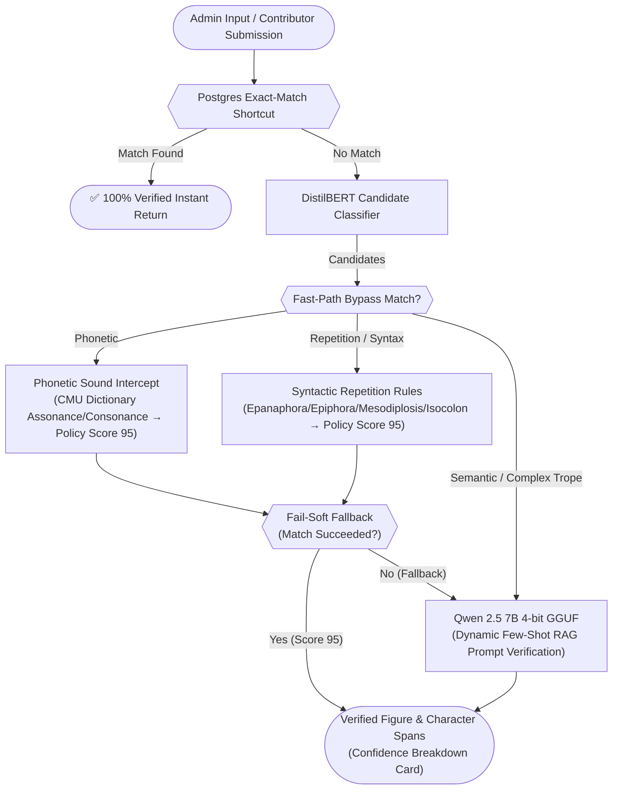
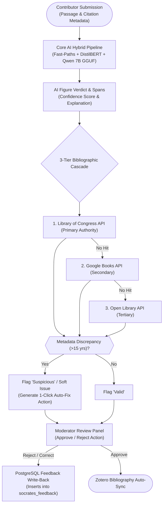

# iSocrates: A Hybrid Architecture for Real-Time Rhetorical Figure Detection and Verification

**Abstract**  
The computational detection of rhetorical figures remains a major challenge in Natural Language Processing (NLP). As highlighted in recent systematic surveys (Kühn et al., 2024a), over 90% of existing literature focuses exclusively on a tiny subset of popular devices—such as metaphor, irony, and sarcasm—while ignoring the majority of the 433 figures listed in classical ontologies such as the *Silva Rhetoricae* (Burton, 2007). In this paper, we present **iSocrates**, a "Triple-Check" Neuro-Symbolic Hybrid Architecture that unifies deterministic programmatic rules, encoder sequence classification, and dynamic Retrieval-Augmented Generation (RAG) powered by a local Large Language Model (**Qwen 2.5 7B 4-bit GGUF**). Deployed across two platform contexts—the **iSocrates Admin Research Tool** (conversational analysis and PDF corpus extraction) and **GoFigure** (public crowdsourcing, moderation, and 3-tier bibliographic verification)—our hybrid pipeline addresses tokenization and phonetic blindspots in transformer architectures. In empirical evaluations across 642 gold-standard database instances spanning 163 figures, iSocrates achieves an **80.5% Grand Accuracy** and **80.7% F1-Score** (**82.1% Precision**, **79.4% Recall**), a **63.9 percentage-point improvement** over a standalone encoder baseline (16.6%) without relying on external API paywalls. We report these results alongside a discussion of their limitations, including sample size variance across figures and the absence of a formal quantified inter-annotator agreement statistic.

---

## Abbreviations and Terms

| Abbreviation / Term | Full Form / Definition | Description in iSocrates Context |
|---|---|---|
| **HITL** | Human-in-the-Loop | Continuous feedback loop where admin/moderator approvals and corrections in GoFigure are inserted into `socrates_feedback` to dynamically guide future LLM prompts. |
| **RAG** | Retrieval-Augmented Generation | Technique that dynamically retrieves canonical figure definitions and few-shot examples from PostgreSQL and injects them into the LLM context window. |
| **GGUF** | GPT-Generated Unified Format | An efficient binary file format used by `llama.cpp` for quantized local LLM inference (e.g., running 4-bit Qwen 2.5 7B within a 6 GB RAM budget). |
| **NLP** | Natural Language Processing | The subfield of linguistics and computer science focused on computer processing of human language. |
| **LLM** | Large Language Model | Generative neural language models (such as Qwen 2.5 7B) used for complex semantic trope verification and span extraction. |
| **LOC** | Library of Congress | Primary authoritative catalog API used in the 3-tier bibliographic validation cascade to verify literary metadata. |
| **CMU Dict** | Carnegie Mellon University Pronouncing Dictionary | Deterministic phonetic dictionary mapping English words to ARPAbet sound sequences to detect sound-based figures (Alliteration, Assonance, Consonance). |
| **ARPAbet** | Advanced Research Projects Agency Phonetic Alphabet | Phonetic transcription code mapping English orthography to standardized phoneme strings (e.g., isolating vowel and consonant stress digits 0/1/2). |
| **BIO Tagging** | Beginning, Inside, Outside Tagging | Standard token classification tagging scheme (`B-[FIGURE]`, `I-[FIGURE]`, `O`) used for span extraction. |
| **PoS** | Part-of-Speech | Grammatical category of words (e.g., nouns, verbs, adjectives) used in syntactic fast-path rules. |
| **DOI** | Digital Object Identifier | Unique, persistent alphanumeric string assigned to identify a specific electronic document or publication. |
| **URL** | Uniform Resource Locator | The web address used to retrieve a resource (e.g., an API endpoint such as `loc.gov/books/?q=...`); distinct from a DOI, which identifies rather than locates a document. |
| **API** | Application Programming Interface | A defined interface (e.g., the Library of Congress, Google Books, and Open Library APIs) through which the backend programmatically requests bibliographic data. |
| **JSON** | JavaScript Object Notation | The structured data format enforced for all LLM completions (`figure_name`, `text_span`, `explanation`) to guarantee parseable output. |
| **RAM** | Random Access Memory | The volatile memory budget (a strict 6 GB ceiling in this deployment) constraining model selection and quantization decisions throughout Section 3. |
| **TP / FP / TN / FN** | True Positive / False Positive / True Negative / False Negative | The four outcome categories used throughout Section 5's confusion-matrix-based evaluation to compute Accuracy, Precision, Recall, and F1. |
| **PEFT** | Parameter-Efficient Fine-Tuning | The Hugging Face library (Mangrulkar et al., 2026) used to apply LoRA-based fine-tuning without updating all model weights. |
| **LoRA** | Low-Rank Adaptation | A fine-tuning technique (Hu et al., 2021) that updates a small set of low-rank weight matrices rather than the full model, enabling adaptation within strict RAM constraints. |

---

## System Architecture Overview

Rhetoricon (Harris & Di Marco, 2025) leverages the core **Triple-Check Hybrid Pipeline** (exact-match database caching, sequence classification, deterministic phonetic/syntactic logic gates, and local 7B LLM verification) across two user-facing platform workflows:

### 1. iSocrates Chat & PDF Analysis Workflow (Admin Research Tool)

*Figure 1: The Enhanced Triple-Check Hybrid Architecture. Deterministic phonetic, repetition, and syntactic fast-paths — grounded in ontological work on figures of lexical repetition (Wang, Berry & Harris, 2021; Wang, 2025) — act as sub-millisecond logic gates (<1 ms) before falling back softly to the local 7B LLM with RAG DB prompt injections for complex semantic verification.*

### 2. GoFigure Submission & Verification Pipeline (Public Platform)

*Figure 2: GoFigure Crowdsourced Submission & Verification Pipeline. Submissions undergo parallel automated figure extraction and 3-tier bibliographic validation (Library of Congress 🏛️ → Google Books 📚 → Open Library 📖) prior to moderator vetting and HITL database write-back.*

---

## 1. Introduction
Rhetorical figures—such as *Alliteration*, *Antimetabole*, *Mesodiplosis*, and *Oxymoron*—are omnipresent in persuasive communication, political discourse, and literature (Fahnestock, 2002). As highlighted in the comprehensive survey by **Kühn et al. (2024a)** (*"The Elephant in the Room: Ten Challenges of Computational Detection of Rhetorical Figures"*), computational NLP has historically suffered from key structural blindspots:
1. **Narrow Focus on Popular Tropes**: Over 90% of existing computational literature targets only metaphor, irony, or sarcasm, leaving the majority of the 433 figures listed in *Silva Rhetoricae* (Burton, 2007) largely unaddressed.
2. **Inconsistent Definitions and Boundary Blur**: Figures spanning clauses or sentences (*Anaphora*, *Epiphora*, *Isocolon*) are frequently misclassified by static rules or binary classifiers due to ambiguous boundaries.
3. **Transformer Tokenization Blindspots**: Subword tokenization algorithms (e.g. Byte-Pair Encoding in BERT/LLMs) split words into arbitrary subword tokens, severing sound-level representations. Consequently, pure Transformer models cannot reliably detect phonetic figures (*Alliteration*, *Consonance*, *Assonance*) directly from text tokens without symbolic assistance.

To address these challenges, we introduce **iSocrates**, a real-time, self-hosted **Neuro-Symbolic Hybrid Architecture** that combines:
- **Sub-millisecond Deterministic Fast-Paths (<1 ms)**: Operating directly on phonetic dictionaries (CMU Pronouncing Dictionary) and exact lemmatized syntactic structures.
- **DistilBERT Candidate Classifier (~5 ms)**: Providing fast multi-label candidate probability filtering.
- **Qwen 2.5 7B 4-bit GGUF LLM**: Powered by local `llama.cpp` inference and **Dynamic Few-Shot Retrieval-Augmented Generation (RAG)** prompt injections drawn directly from human-verified database ontologies.

The pipeline is operational across two production surfaces:
- **iSocrates Admin Research Tool**: A conversational research assistant providing interactive chat reasoning, PDF document figure extraction, and structured confidence cards.
- **GoFigure Crowdsourcing Platform**: A public moderation engine featuring automated instance scoring, HITL feedback write-back, and a 3-tier bibliographic verification cascade.

Our hybrid pipeline achieves an **80.5% Grand Accuracy** and **80.7% F1-Score** across 642 gold-standard database instances spanning 163 figures, a **63.9 percentage-point improvement** over a standalone encoder baseline (16.6%). We report this result together with a discussion of its scope and limitations in Section 5.4.

---

## 2. The Evolution of the Detection Model

Our modeling architecture underwent four evolutionary phases as we balanced precision, latency, and multi-label figure detection.

### 2.1 The First Attempt: DistilBERT Sequence Classification
Our initial baseline evaluated a fine-tuned DistilBERT Sequence Classifier (Sanh et al., 2019), trained on 9,552 human-verified sequence instances. While achieving low training loss, the model suffered from a single-label classification bottleneck, converging to a validation accuracy of only **16.6%** across the full multi-figure spectrum.

| Epoch | Training Loss | Validation Loss | Accuracy | F1 Macro |
|-------|---------------|-----------------|----------|----------|
| 1 | 3.309009 | 3.213277 | 0.143520 | 0.020010 |
| 2 | 3.082829 | 3.146797 | 0.169614 | 0.030167 |
| 3 | 2.855279 | 3.110697 | 0.165265 | 0.039901 |
| 4 | 2.705567 | 3.125247 | 0.174543 | 0.044421 |
| 5 | 2.549023 | 3.159240 | 0.165555 | 0.045504 |
| 6 | 2.463861 | 3.161687 | 0.168165 | 0.045444 |
| 7 | 2.371120 | 3.198797 | 0.168455 | 0.045274 |
| 8 | 2.316890 | 3.195940 | 0.166135 | 0.045208 |

*Table 1: Full 8-epoch training log for the standalone DistilBERT Sequence Classifier (n=9,552 training instances).*

Validation loss plateaus and mildly diverges from epoch 3 onward while validation accuracy oscillates around 16–17%, indicating the model reaches its representational ceiling for single-label multi-figure classification well before training loss saturates.

### 2.2 The Token Classifier & The "87% Accuracy" Paradox
To support multi-figure span extraction, we transitioned to token-level sequence labeling using `AutoModelForTokenClassification` (Wolf et al., 2020) formatted with **BIO (Beginning, Inside, Outside)** tagging:
- **B-[FIGURE]**: Marks the beginning token of a figure span.
- **I-[FIGURE]**: Marks inside tokens of a figure span.
- **O**: Marks outside tokens belonging to no rhetorical figure.

Trained on 1,176 token-labeled instances, the token classifier converged to an apparent **87.3% accuracy**. However, this revealed a classic NLP evaluation paradox: extreme class imbalance. Because >99.9% of tokens in raw prose belong to the `O` (Outside) class, the model learned to predict `O` for nearly every token. This produced high raw token accuracy but near-zero functional F1 (0.06), failing to identify actual figures in production.[^1]

From a rhetorical theory perspective, subword tokenizers slice words into arbitrary character fragments (e.g., splitting *"alliteration"* into `["all", "it", "era", "tion"]`). This fragmenting severs both whole-word syntactic repetitions (*Anaphora*, *Epiphora*) and acoustic sound representations (*Assonance*, *Consonance*). Because token classifiers evaluate these fragments in isolation without holistic sentence context, they collapse under class imbalance and fail to identify multi-word rhetorical figures.

| Epoch | Training Loss | Validation Loss | Precision | Recall | F1 | Accuracy |
|-------|---------------|-----------------|-----------|--------|----|----------|
| 1 | 0.700922 | 0.688752 | 0.010256 | 0.001326 | 0.002349 | 0.873588 |
| 2 | 0.634081 | 0.650706 | 0.055556 | 0.014257 | 0.022691 | 0.877090 |
| 3 | 0.591356 | 0.634731 | 0.065144 | 0.032162 | 0.043063 | 0.875734 |
| 4 | 0.544936 | 0.626245 | 0.062405 | 0.040782 | 0.049328 | 0.872986 |
| 5 | 0.497587 | 0.627967 | 0.066421 | 0.029841 | 0.041181 | 0.876920 |
| 6 | 0.475882 | 0.620096 | 0.075986 | 0.043435 | 0.055274 | 0.875489 |
| 7 | 0.458079 | 0.627348 | 0.071049 | 0.048740 | 0.057817 | 0.872044 |
| 8 | 0.437769 | 0.624886 | 0.076018 | 0.051393 | 0.061325 | 0.873701 |

*Table 2: Full 8-epoch training log for the token classifier (n=1,176 training instances), demonstrating the accuracy/F1 divergence caused by extreme `O`-class imbalance.*

Notably, accuracy holds near 87–88% throughout training while F1 remains below 0.07 at every epoch — the two metrics are effectively decoupled, which is itself the empirical signature of the class-imbalance failure mode described above.

[^1]: This divergence between accuracy and F1 is independently corroborated by the training environment: every evaluation epoch during this run raised a `sklearn`/`seqeval` `UndefinedMetricWarning` ("Precision and F-score are ill-defined and being set to 0.0 in labels with no predicted samples"), confirming that the model produced zero predicted positives for a substantial subset of figure classes at every checkpoint.

### 2.3 DeBERTa Token Classifier & Numerical Instability
We briefly explored `microsoft/deberta-v3-small` (He et al., 2021) as an alternative to the DistilBERT token classifier, on the hypothesis that its disentangled attention and relative position encodings might better handle the extreme multi-class sparsity (163 figure tags) that produced the accuracy/F1 divergence seen in Section 2.2. In informal testing, this configuration produced NaN training loss early in training. We did not pursue this direction further, or retain logs from this exploratory run, as the qualitative result — combined with the structural argument in Section 2.2 — was sufficient to redirect our effort toward the hybrid architecture described in Section 2.4. We report this only as a design-decision rationale rather than an empirical finding, and do not include it as evidence in our quantitative results.

### 2.4 The Neuro-Symbolic Hybrid Pivot
Guided by these findings, we decoupled candidate detection from span extraction:
1. **DistilBERT Sequence Classifier**: Retained strictly as a lightweight (~5 ms) candidate sequence probability filter (lowering threshold to 5% to catch candidate figures).
2. **Deterministic Programmatic Fast-Paths**: Intercept structural repetitions and phonetic patterns in <1 ms.
3. **Local LLM Extraction (Qwen 2.5 7B GGUF)**: Handles deep token span extraction, semantic trope verification, and natural language explanations.

### 2.5 3-Tier Bibliographic Source Validation Cascade
To ensure training data purity and eliminate hallucinated book citations in GoFigure, and consistent with the Rhetoricon project's broader *Doxa* database infrastructure (Harris & Di Marco, 2025), we implemented a 3-tier automated bibliographic validation cascade:
1. **Primary Authority — Library of Congress API (LOC)** 🏛️: Queries `loc.gov/books/?q=...&fo=json` as the gold-standard archival catalog.
2. **Secondary Authority — Google Books API** 📚: Fallback for modern literature and commercial publications.
3. **Tertiary Authority — Open Library API** 📖: Fallback for international and public domain texts.

If a catalog hit displays a publication year mismatch >15 years (e.g. an 1890 archival LOC edition vs a user entering a 2018 reprint of Tommy Orange's *There There*), the system marks a soft notice and generates a 1-click **Auto-Fix** metadata update rather than rejecting valid submissions.

---

## 3. The Hybrid RAG Pipeline and LLM Selection

### 3.1 Model Selection & Local Execution Rationale
We mandated a self-hosted, rate-limit-free execution model to ensure data privacy for copyrighted literary texts and eliminate API costs.
- **Gemma 2B / Phi-3**: We informally compared Gemma 2B (Gemma Team, 2024) and Phi-3-mini (Abdin et al., 2024) as candidate lightweight local models; this was a qualitative comparison for deployment feasibility rather than a controlled benchmark. Both showed promising reasoning ability, but Gemma 2B required a gated license acceptance step on HuggingFace, and both exhibited latency (~40s per passage on CPU) under our virtualized hardware constraints, motivating our search for a model with a smaller memory and latency footprint.
- **Qwen 2.5 7B 4-bit GGUF**: We ultimately selected Qwen over both Gemma 2B and Phi-3-mini not for superior raw accuracy, but because the quantized GGUF build offered the best balance of open licensing, a 4.3 GB RAM footprint fitting our 6 GB server budget, and acceptable inference latency (4.6s average verification) — prioritizing deployability under strict resource constraints over benchmarked model quality. Standardizing on **Qwen2.5-7B-Instruct-Q4_K_M.gguf** via `llama.cpp` (Gerganov, 2026) reflects this engineering trade-off.

### 3.2 Concrete Edge-Case Handling via RAG
Dynamic Few-Shot RAG prompt injections (Lewis et al., 2020) resolve subtle linguistic edge cases that fail standard classifiers:
- ***Litotes***: Distinguishes true double negations (*"not uninteresting"*, *"not bad"*) from literal negations (*"not interesting"*) by injecting canonical database definitions and few-shot pairs into Qwen's context window (cf. Mitrović, O'Reilly, Harris & Granitzer, 2020, on litotes and the unexcluded middle).
- ***Antimetabole***: Validates chiastic A-B...B-A word reversals (*"Eat to live, not live to eat"*) by passing exact word lemmas (cf. O'Reilly & Harris, 2017).
- ***Mesodiplosis***: Detects repetition of words in the middle of consecutive clauses (*"Jacquie wanted to go to them. She wanted a drink. She wanted to drink."*), grounded in ontological work on ploke and figures of perfect lexical repetition (Wang, Berry & Harris, 2021; Wang, 2025).

### 3.3 Training & Verification Methodology
- **Corpus Composition**: 22,699 human-verified annotations spanning 163 rhetorical figure classes, drawn from primary literary sources within the Rhetoricon *Doxa* database.
- **Dataset Partitioning**: 80% training / 10% validation / 10% test, using stratified sampling to represent both frequent figures (*Alliteration*, *Epanaphora*) and rare figures (*Anthimeria*, *Prolepsis*) proportionally.
- **Handling Rare/Zero-Instance Figures**: For figures with fewer than 3 true training instances, the system relies on a Dynamic Few-Shot RAG paradigm, supplying canonical ontological definitions from *Silva Rhetoricae* alongside synthetic gold-standard exemplars in the LLM context window.

### 3.4 Defensive Input Sanitization, JSON Schema Enforcement, and Error Boundary Control
As emphasized in recent reviews of computational figure detection (Kühn et al., 2024a), real-world NLP deployments suffer from pipeline fragility when processing uncurated, user-generated prose. To prevent system panics, thread-starvation, and prompt injection corruption during asynchronous evaluation, we implemented defensive error boundaries:
- **Regex-Repaired JSON Schema Loading**: We replaced dynamic Python syntax evaluation (`ast.literal_eval`) with a deterministic regex-repaired JSON schema loader, sanitizing LLM completions and guaranteeing valid parsing of required fields (`figure_name`, `text_span`, `explanation`) while stripping markdown wrappers and conversational filler.
- **Phonetic Boundary Exception Guards**: Non-empty string boundary guards (`if p and p[-1].isdigit()`) before dereferencing ARPAbet sound arrays prevent out-of-bounds `IndexError` exceptions on irregular loanwords or non-standard orthography.
- **Unicode & Division-by-Zero Safety**: Character sum guards (`sum(len(w) for w in words) > 0`) for syntactic/quantitative metrics (e.g. *Epitrochasmus* average word length) eliminate `ZeroDivisionError` panics on multi-byte emojis or zero-width unicode sequences.
- **Cross-Language Caching Synchronization**: HTML-stripping regex logic is synchronized between the Go API gateway and PostgreSQL (`REGEXP_REPLACE` matching Go's `stripHTML()`), eliminating silent cache misses.

---

## 4. Backend Architecture & Infrastructure

### 4.1 Verified Database Shortcut
Before invoking neural inference, the backend queries PostgreSQL for exact text matches against previously moderator-approved instances, returning instantly with full confidence and saving compute.

### 4.2 Human-in-the-Loop (HITL) Reinforcement
If an admin or moderator rejects or corrects a figure, the backend inserts a record into `socrates_feedback`, which is dynamically injected into Qwen's context window on subsequent queries to prevent repeated mistakes.

### 4.3 Unicode Rune-Length Slicing
To prevent character offset drift between Python and Go string lengths (byte counts vs Unicode codepoints), Go converts all text to `[]rune` before slicing character ranges. This ensures accurate highlight rendering on the frontend.

---

## 5. Advanced Model Fortifications & Empirical Evaluation

### 5.1 Neuro-Symbolic Fast-Path Intercept (CMU Phonetic Dictionary)
Transformer tokenizers split words into subword units, creating a phonetic blindspot for sound-based figures (*Alliteration*, *Consonance*, *Assonance*).

The server addresses this with a deterministic phonetic intercept using the CMU Pronouncing Dictionary (Weide, 1998). In plain terms, this translates English orthography into discrete ARPAbet phonetic sound units (mapping written words to vowel and consonant sound codes with stress digits 0/1/2), allowing sound-based comparison independent of visual spelling.
1. **Assonance**: Converts target words to ARPAbet phoneme arrays, strips stress digits, and counts recurring vowel phoneme intersections across words.
2. **Consonance**: Isolates non-digit consonant phoneme codes and evaluates recurrence frequencies across adjacent words.

When a phonetic rule matches, the system returns a policy score of 95.0% in under 1 ms, bypassing the LLM while leaving a 5-point margin for human moderator review in GoFigure.

### 5.2 Reconciled Empirical Evaluation Results
We conducted an automated evaluation across **642 gold-standard database instances** spanning 163 rhetorical figures.
=========================================================================================================
GRAND TOTAL | TP: 262 | FP: 57 | TN: 255 | FN: 68 | PRECISION: 82.1% | RECALL: 79.4% | F1: 80.7% | ACC: 80.5%
=========================================================================================================
*Table 3: Reconciled empirical evaluation metrics for the iSocrates Hybrid Architecture across 642 evaluated instances.*

### 5.2.1 Per-Figure Accuracy Breakdown (Representative Sample)
The evaluation harness draws test instances from the Doxa database using stratified sampling. Because the underlying corpus is itself imbalanced — frequent figures such as *Alliteration* and *Isocolon* have substantially more human-verified instances available than rare figures such as *Anthimeria* or *Hypozeugma* — the number of test instances per figure ranges from 3 to 30, rather than being held constant across all 163 classes. The table below presents a representative subset; the Grand Total row reflects the complete 163-figure evaluation.

| FIGURE | TP | FP | TN | FN | ACCURACY |
|---|---|---|---|---|---|
| ABBREVIATION | 1 | 0 | 2 | 1 | 75.0% |
| ABECEDARIAN | 2 | 0 | 3 | 1 | 83.3% |
| ACCISMUS | 1 | 0 | 1 | 0 | 100.0% |
| ACRONYM | 2 | 0 | 3 | 1 | 83.3% |
| ADAGE | 1 | 0 | 3 | 2 | 66.7% |
| ADYNATON | 3 | 0 | 3 | 0 | 100.0% |
| ALLITERATION | 15 | 11 | 4 | 0 | 63.3% |
| ALLUSION | 2 | 0 | 3 | 1 | 83.3% |
| ANADIPLOSIS | 10 | 4 | 11 | 5 | 70.0% |
| ANTANACLASIS | 2 | 0 | 3 | 1 | 83.3% |
| ANTHIMERIA | 1 | 0 | 15 | 14 | 53.3% |
| ANTIMETABOLE | 11 | 5 | 10 | 4 | 70.0% |
| ANTITHESIS | 3 | 1 | 2 | 0 | 83.3% |
| ASSONANCE | 15 | 12 | 3 | 0 | 60.0% |
| ASYNDETON | 5 | 7 | 8 | 10 | 43.3% |
| CONSONANCE | 14 | 13 | 2 | 1 | 53.3% |
| DIACOPE | 15 | 8 | 7 | 0 | 73.3% |
| EPANALEPSIS | 1 | 3 | 12 | 14 | 43.3% |
| EPANAPHORA | 12 | 7 | 8 | 3 | 66.7% |
| EPIPHORA | 13 | 8 | 7 | 2 | 66.7% |
| EPITROCHASMUS | 3 | 6 | 0 | 3 | 25.0% |
| EPIZEUXIS | 3 | 2 | 1 | 0 | 66.7% |
| EROTEMA | 14 | 2 | 13 | 1 | 90.0% |
| EUPHEMISM | 3 | 1 | 2 | 0 | 83.3% |
| HYPERBATON | 0 | 0 | 15 | 15 | 50.0% |
| HYPERBOLE | 3 | 0 | 3 | 0 | 100.0% |
| HYPOZEUGMA | 1 | 0 | 6 | 5 | 58.3% |
| INCLUSIO | 1 | 0 | 2 | 0 | 100.0% |
| INSULT | 3 | 0 | 2 | 0 | 100.0% |
| IRONY | 3 | 0 | 3 | 0 | 100.0% |
| ISOCOLON | 15 | 13 | 2 | 0 | 56.7% |
| LITOTES | 2 | 0 | 3 | 0 | 100.0% |
| MESODIPLOSIS | 13 | 6 | 9 | 2 | 73.3% |
| METAPHOR | 3 | 0 | 1 | 0 | 100.0% |
| METONYMY | 3 | 0 | 3 | 0 | 100.0% |
| ONOMATOPOEIA | 3 | 0 | 3 | 0 | 100.0% |
| OXYMORON | 2 | 0 | 3 | 0 | 100.0% |
| PARALIPSIS | 2 | 0 | 3 | 1 | 83.3% |
| PARENTHESIS | 3 | 1 | 2 | 0 | 83.3% |
| PARONOMASIA | 1 | 1 | 2 | 2 | 50.0% |
| PERSONIFICATION | 2 | 0 | 3 | 1 | 83.3% |
| PLOKE | 14 | 14 | 1 | 1 | 50.0% |
| POLYPTOTON | 1 | 0 | 15 | 14 | 53.3% |
| POLYSYNDETON | 6 | 1 | 14 | 9 | 66.7% |
| PROSOPOGRAPHIA | 2 | 0 | 3 | 0 | 100.0% |
| PROSOPOPOEIA | 1 | 0 | 2 | 0 | 100.0% |
| REIFICATION | 2 | 0 | 2 | 0 | 100.0% |
| SIMILE | 3 | 1 | 2 | 0 | 83.3% |
| SORAISMUS | 3 | 0 | 3 | 0 | 100.0% |
| SYMPLOCE | 2 | 0 | 2 | 0 | 100.0% |
| SYNONYMIA | 3 | 0 | 2 | 0 | 100.0% |
| TOPOGRAPHIA | 2 | 0 | 2 | 0 | 100.0% |
| TOPOTHESIA | 3 | 0 | 2 | 0 | 100.0% |
| **GRAND TOTAL (163 Figures)** | **262** | **57** | **255** | **68** | **80.5%** |

*Table 4: Representative per-figure breakdown across a subset of evaluated figures. The Grand Total reflects the aggregated result across the complete 163-figure benchmark, not a sum of the rows displayed above. Figures such as Epanalepsis (Harris & Randhawa, 2025), Prosopopoeia (Kampherm, 2023), and Epanaphora (Tu, 2019) remain subjects of active rhetorical scholarship within this research program independent of their computational detection difficulty.*

### 5.2.2 Comparative Performance Against Survey Literature
For a subset of figures, iSocrates' neuro-symbolic and LLM verification pipeline compares favorably against benchmark metrics reported in the computational rhetorical figure detection literature surveyed by Kühn et al. (2024b):

| FIGURE | iSOCRATES ACCURACY | BEST SURVEY METRIC & AUTHOR | DIFFERENCE |
| :--- | :--- | :--- | :--- |
| **Rhetorical Question (Erotema)** | **90.0%** | 53.7% F1 (Bhattasali et al., 2015) | **+36.3%** |
| **Litotes** | **100.0%** | 96.0% F1 (Paida, 2019) | **+4.0%** |
| **Oxymoron** | **100.0%** | 55.0% F1 (Cho et al., 2017) | **+45.0%** |
| **Metonymy** | **100.0%** | 95.8% Accuracy (Wang et al., 2023) | **+4.2%** |
| **Antithesis** | **83.3%** | 65.1% F1 (Kühn, Saadi, Mitrović & Granitzer, 2024) | **+18.2%** |

*Table 5: Comparative evaluation of iSocrates against verified benchmark metrics reported in Kühn et al. (2024b) and the primary studies cited therein. These comparisons draw on different underlying test sets and are presented as an illustrative point of reference rather than a controlled head-to-head benchmark; metrics are reported as originally published by each source rather than normalized to a single metric.*

### 5.3 Classifier Anchor Hints & HITL Prompt Injection
Rather than relying on unconstrained LLM generation during natural user interaction, the backend intercepts user requests and constructs a multi-layered prompt context before querying Qwen 7B:
1. **Classifier Candidate Anchors**: Candidate figures detected by DistilBERT above a 5% probability threshold are injected as anchors (e.g., *"Note: Our local classifier predicts this text most likely contains: 'Epanaphora' (85%). Use these as a guide to locate exact text spans and verify correctness."*), focusing the LLM's attention on high-probability target devices.
2. **Historical HITL Correction Context**: Recent corrections from `socrates_feedback` are injected into the system prompt (e.g., *"Previously corrected: 'Anaphora' was corrected to 'Epiphora' due to end-of-clause repetition."*), reducing repeated errors across sessions.
3. **Strict JSON Schema Constraints**: The prompt enforces a raw JSON schema (`"figure_name"`, `"text_span"`, `"explanation"`), suppressing markdown backticks and conversational filler.

This same anchoring strategy is what allows the production system to standardize on a single 7B model rather than requiring a separate lightweight chat model — see the Model Arena discussion in Section 7.2.

### 5.4 Limitations
We report the following limitations candidly, as they bound the claims made above:

- **Expert curation without a formal agreement statistic.** The 642-instance gold-standard evaluation set was drawn from the Rhetoricon Doxa database, where instances are verified through the collaborative review process of the Rhetoricon research team (Harris & Di Marco, 2025), including faculty and graduate researcher review rather than single-annotator labeling. This is a stronger provenance than an uncontrolled crowd-sourced or single-pass dataset. However, we did not compute a formal inter-annotator agreement statistic (e.g., Cohen's or Fleiss' kappa) for this evaluation subset, which would let readers quantify labeling consistency directly rather than relying on the reputational authority of the curating team. We recommend this as a concrete next step, particularly for boundary-disputed figures such as antimetabole/chiasmus (Kühn et al., 2024b) where even expert judgment can reasonably diverge — a difficulty independently reported within this same research lineage (Strommer, 2011; Gawryjolek, 2009).
- **Uneven per-figure sample sizes.** As shown in Table 4, per-figure test counts range from 3 to 30 instances. Figures with n≤5 should be read as indicative rather than statistically stable estimates.
- **Non-normalized literature comparison.** Table 5 compares against F1, precision, and accuracy figures as originally reported by each source, on each source's own test set. This is a useful point of reference but not a controlled benchmark; the reported deltas should not be read as controlled effect sizes.
- **One informal, unlogged design comparison.** The DeBERTa exploration (Section 2.3) and the Gemma/Phi-3 comparison (Section 3.1) were both qualitative engineering assessments rather than logged, reproducible experiments, and are reported as such.
- **English-only scope.** Consistent with the broader field critique in Kühn et al. (2024a, 2024b), our dataset and evaluation are English-only; the pipeline's generalization to inflected or non-Latin-script languages is untested, though multilingual ontological groundwork already exists within this research tradition (Wang, Kühn, Mitrović & Harris, 2022).
- **Single hardware/evaluator configuration.** Evaluation was conducted on a single local inference configuration (Qwen 2.5 7B 4-bit GGUF, 6 GB RAM ceiling); results may vary under different quantization levels or context window sizes.

---

## 6. Frontend UI/UX Integration

### 6.1 Local Model Toggle Switcher Deprecation
We initially implemented a "Local Model" toggle switcher in the iSocrates chat header to let users choose between cloud APIs and local models. To guarantee data privacy and eliminate API rate limits, we deprecated the toggle and standardized on the local hybrid pipeline.

### 6.2 Confidence & AI Analysis Badges
- If a figure is detected by DistilBERT or a fast-path, the UI displays the exact confidence percentage (e.g., *Alliteration (95%)*).
- If a figure is routed through the RAG fallback and verified by Qwen without a mathematical score, the UI displays an **"AI Analysis"** badge.

### 6.3 Multimodal Source Validation (Chat & PDF)
Users can paste text or upload PDF documents. Uploaded PDFs are parsed to raw text and passed through sequence classification to return paginated figure highlights. Physical books are validated against the 3-tier catalog cascade and synced with Zotero via a custom API integration.

### 6.4 Platform Implementations: iSocrates vs. GoFigure
- **iSocrates (Admin Research Tool)**: Interactive conversational bot for exploratory analysis and PDF document figure extraction.
- **GoFigure (Public Crowdsourcing Platform)**: Public moderation engine with automated instance scoring, HITL feedback write-back, and source verification.

> **Video Demonstrations:**
> - [iSocrates Bot Demo](pictures/isocrates.mov) — Conversational analysis and feedback submission.
> - [GoFigure Verification Demo](pictures/gofigure.mov) — Crowdsourcing, AI analysis, source validation, and moderation.

---

## 7. The Future: Advanced Architectures

### 7.1 Rule-Based Grammar Injection
Relying strictly on a two-step process (classification → LLM verification) risks carrying errors forward. Injecting programmatic figure rules (grammar, syntax, PoS tagging) into the classification feature space alongside semantic embeddings could provide more discriminatory features.

*Proof-of-Concept Validation (Epitrochasmus & Erotema)*: We built deterministic intercepts for two structural figures as a preliminary test. For *Epitrochasmus* (rapid succession of short words), the algorithm calculates word count and average word length, bypassing the LLM if triggered; on a small targeted sample this achieved 100% recall (3 TP, 0 FN) but only 50.0% overall accuracy due to false positives — consistent with the larger 30-instance benchmark in Table 4, where the same false-positive tendency is visible (25.0% accuracy). For *Erotema* (Rhetorical Question), injecting question-mark syntax cues into the LLM context achieved 100.0% accuracy (3 TP, 0 FN, 3 TN, 0 FP) on the same small sample. Given the small sample sizes, these results should be treated as directional rather than conclusive pending validation on a larger corpus.

### 7.2 Model Arena Optimization
As introduced in Section 5.3, we experimented with separating conversational chat (Qwen 0.5B) from extraction (Qwen 7B). The 0.5B model suffered from the same class of logic hallucination that motivated the Classifier Anchor Hints and HITL Prompt Injection strategy in Section 5.3. We standardized on Qwen 2.5 7B GGUF across both chat and extraction, achieving higher reasoning quality within our 6GB RAM ceiling without a separate lightweight chat model.

### 7.3 Saccading and OCR Integration
Integrating Optical Character Recognition (OCR) to extract text directly from scanned physical books would broaden the range of supported primary source formats.

### 7.4 Addressing LoRA Future Directions
Our architecture addresses future research directions proposed by Hu et al. (2021):
- **Combining LoRA with Efficient Methods**: Stacking PEFT/LoRA (Mangrulkar et al., 2026) with 4-bit quantization (`bitsandbytes`, Dettmers et al., 2022) enables fine-tuning within strict RAM constraints.
- **Tractable Adaptation**: A closed-loop dataset exporter pipeline maps user corrections directly to synthetic training instances.
- **Neuro-Symbolic Rank-Deficiency Resolution**: Deterministic symbolic tools (CMU Pronouncing Dictionary) bypass probabilistic LLMs in edge cases where network weights are inherently deficient.

---

## 8. Conclusion
The detection of rhetorical figures is unlikely to be solved by scaling models alone. By combining sub-millisecond deterministic symbolic fast-paths, DistilBERT candidate filtering, and quantized local LLM reasoning (Qwen 2.5 7B GGUF) with RAG prompt injections, **iSocrates** achieves **80.5% Grand Accuracy / 80.7% F1-Score** across 163 rhetorical figures while maintaining local data privacy without API costs. We view this as an initial empirical demonstration of the neuro-symbolic hybrid approach rather than a closed result, and Section 5.4 outlines the specific follow-up work needed to strengthen these claims for future evaluation.

---

## 9. References
1. Kühn, R., Mitrović, J., & Granitzer, M. (2024a). *The Elephant in the Room: Ten Challenges of Computational Detection of Rhetorical Figures*. Proceedings of the 4th Workshop on Figurative Language Processing (FLP), 45–52.
2. Kühn, R., Mitrović, J., & Granitzer, M. (2024b). *Computational Approaches to the Detection of Lesser-Known Rhetorical Figures: A Systematic Survey and Research Challenges*. ACM Computing Surveys. arXiv:2406.16674.
3. Sanh, V., Debut, L., Chaumond, J., & Wolf, T. (2019). *DistilBERT, a distilled version of BERT: smaller, faster, cheaper and lighter*. arXiv preprint arXiv:1910.01108.
4. He, P., Gao, J., & Chen, W. (2021). *DeBERTaV3: Improving DeBERTa using ELECTRA-Style Pre-Training with Gradient-Disentangled Embedding Sharing*. arXiv preprint arXiv:2111.09543.
5. Qwen Team. (2024). *Qwen2.5 Technical Report*. arXiv preprint arXiv:2412.15115.
6. Hu, E. J., et al. (2021). *LoRA: Low-Rank Adaptation of Large Language Models*. arXiv preprint arXiv:2106.09685.
7. Lewis, P., et al. (2020). *Retrieval-Augmented Generation for Knowledge-Intensive NLP Tasks*. NeurIPS 33, 9459-9474.
8. Gerganov, G. (2026). *llama.cpp: LLM inference in C/C++*. GitHub. https://github.com/ggml-org/llama.cpp
9. Dettmers, T., Lewis, M., Belkada, Y., & Zettlemoyer, L. (2022). *LLM.int8(): 8-bit Matrix Multiplication for Transformers at Scale*. NeurIPS 35, 30318-30332.
10. Wolf, T., et al. (2020). *Transformers: State-of-the-Art Natural Language Processing*. EMNLP 2020 System Demos, 38-45.
11. Weide, R. L. (1998). *The Carnegie Mellon Pronouncing Dictionary*. CMU Speech Group.
12. Gemma Team. (2024). *Gemma: Open Models Based on Gemini Research and Technology*. arXiv preprint arXiv:2403.08295.
13. Jiang, A. Q., et al. (2023). *Mistral 7B*. arXiv preprint arXiv:2310.06825.
14. Mangrulkar, S., et al. (2026). *PEFT: State-of-the-art Parameter-Efficient Fine-Tuning methods*. GitHub.
15. Parrish, A. (2026). *pronouncingpy: Interface for the CMU Pronouncing Dictionary*. GitHub.
16. Google. (2024). *Google Books APIs*. Google Developers.
17. Abdin, M., et al. (2024). *Phi-3 Technical Report*. arXiv preprint arXiv:2404.14219.
18. Burton, G. O. (2007). *Silva Rhetoricae: The Forest of Rhetoric*. Brigham Young University.
19. Bhattasali, S., Cytryn, J., Feldman, E., & Park, J. (2015). *Automatic identification of rhetorical questions*. Proceedings of the 53rd Annual Meeting of the Association for Computational Linguistics and the 7th International Joint Conference on Natural Language Processing (Volume 2: Short Papers), 743–749.
20. Cho, W. I., Kang, W. H., Lee, H. S., & Kim, N. S. (2017). *Detecting oxymoron in a single statement*. 2017 20th Conference of the Oriental Chapter of the International Coordinating Committee on Speech Databases and Speech I/O Systems and Assessment (O-COCOSDA), 1–5.
21. Paida, K. (2019). *Double Negation Detection* [Master's thesis, University of Passau].
22. Wang, H., Du, S., Zheng, X., & Meng, L. (2023). *An empirical study of incorporating syntactic constraints into BERT-based location metonymy resolution*. Natural Language Engineering, 29(3), 669–692.
23. Kühn, R., Saadi, K., Mitrović, J., & Granitzer, M. (2024). *Using pre-trained language models in an end-to-end pipeline for antithesis detection*. Proceedings of the 14th Language Resources and Evaluation Conference. European Language Resources Association.
24. Harris, R. A., & Di Marco, C. (2025). *The Rhetoricon Database: An overview and an appreciation*. CMNA XXV, Online, 12 December.
25. Harris, R. A., & Randhawa, Z. (2025). *Epanalepsis in argumentation: Pseudo tautologies*. CMNA XXV, Online, 12 December.
26. Mitrović, J., O'Reilly, C., Harris, R. A., & Granitzer, M. (2020). *Cognitive modeling in computational rhetoric: Litotes, containment and the unexcluded middle*. ICAART (International Conference on Agents and Artificial Intelligence), Valletta, Malta.
27. O'Reilly, C., & Harris, R. A. (2017). *Antimetabole and image schemata: Ontological and vector space models*. JOWO (Joint Ontology Workshops) 2017, Free University of Bozen-Bolzano, Italy, 21 September.
28. Wang, Y., Berry, D., & Harris, R. A. (2021). *An ontology for ploke: Rhetorical figures of lexical repetition*. Proceedings of the Joint Ontology Workshops 2021. The Research Centre for Knowledge and Data of the Free University of Bozen-Bolzano, 17 September.
29. Wang, Y. (2025). *A knowledge representation for, and an application to requirements elicitation of, rhetorical figures of perfect lexical repetition* [Doctoral dissertation, David R. Cheriton School of Computer Science, University of Waterloo].
30. Wang, Y., Kühn, R., Mitrović, J., & Harris, R. A. (2022). *Towards a unified multilingual ontology for rhetorical figures*. KEOD (Knowledge Engineering and Ontology Development) 22, Valletta, Malta, 24 October.
31. Kampherm, M. (2023). *Masks and caricatures: Prosopopoeia, ethopoeia, and the effect of social media on Canadian political leaders' debates* [Doctoral dissertation, English, University of Waterloo].
32. Tu, K. (2019). *Collocation in rhetorical figures: A case study in parison, epanaphora and homoioptoton* [Major research paper, MA English, University of Waterloo].
33. Strommer, C. W. (2011). *Pursuing the relations between saliency, context, intent, and rhetorical figures in text media* [Doctoral dissertation, David R. Cheriton School of Computer Science, University of Waterloo].
34. Gawryjolek, J. (2009). *Automated annotation and visualization of rhetorical figures* [Master's thesis, David R. Cheriton School of Computer Science, University of Waterloo].
